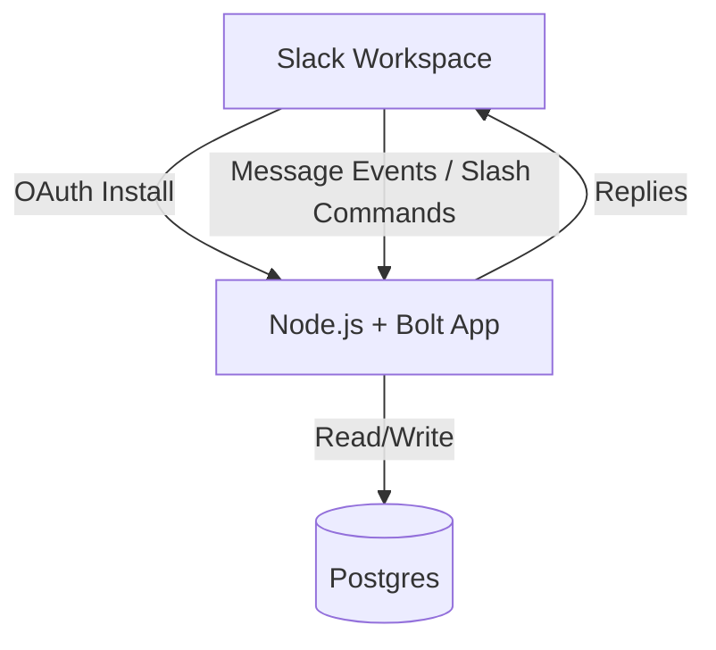

# Architecture

## Overview
The system is a Slack app built with Slack Bolt (Node.js) and a Postgres database. It supports OAuth installs across multiple workspaces and awards points via message events.

## Components
- Slack app (OAuth + Events + Slash Commands)
- Node.js app server using Slack Bolt + ExpressReceiver
- Postgres database
- Lifecycle event bus (in-process pub/sub)

## Diagram

## Data flow
### OAuth install
1. User visits `/slack/install`.
2. Slack redirects to `/slack/oauth_redirect` after authorization.
3. Installation data is encrypted and stored in Postgres.

### Award points
1. Slack sends a message event to `/slack/events`.
2. The app parses mentions followed by `++`.
3. A `point_events` row is inserted for each recipient.
4. The `points` aggregate is incremented.
5. The app replies with updated totals.

### Query points
1. User runs `/points` (optionally with `@user` or `me`).
2. The app queries Postgres for totals or a leaderboard.
3. The app responds with results.

## Data model
- `slack_installations`: OAuth install data (encrypted JSON payload).
- `processed_awards`: idempotency records for message awards.
- `slack_oauth_states`: OAuth state verification data with TTL.
- `point_events`: audit trail of awards (giver, receiver, reason).
- `points`: aggregated totals per team/user.

## Deployment
- Docker Compose runs the app and Postgres locally.
- Devcontainer attaches to the Compose services for consistent development.
- In production, the app can run in any container environment with a Postgres connection.
